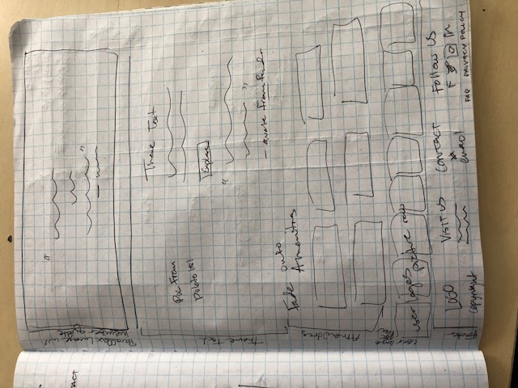

# Co-working Site: LoveWork

#### Mock Freelance Co-Working Contract, 14 September 2018.
#### By Talia Haller

## Description

A new co-working startup came to Portland, Oregon and hired me to create this website for them. This site includes a landing page, contact page, page featuring amenities, and a page detailing cost/membership/how to join.

Full Wireframe of Website:

Desktop Landing Page:

Desktop About Page:

Desktop Membership Page:

Desktop Contact Page:

## User Stories and Personas

1. *Jenny, the Artist:* This type of user needs a creative environment where they can dress in a relaxed fashion, have inspiration all around, and have quick access to on-site coffee and snacks. They want community and enjoy colorful atmospheres. They enjoy the occasional distraction to help them free their mind and focus on something else for a bit. A Thursday afternoon yoga class is great.

2. *Mark, the Writer:* This type of user needs to be able to focus but enjoys the presence of others working around them, the distant buzz of conversation, and the availability of coffee and energy sources. They’re the type to get extremely focused and dive into their work for hours; but, when the writer’s block hits, need a distraction and really enjoys conversing about ideas with others in the vicinity.

3. *Lorrie, the Entrepreneur:* This type of user needs a space they can be professional in but that is homey and comfortable enough that they can relax and get into their optimized workflow. They may have family and other distractions at home and they need a place where they can really get work done without feeling too isolated.

4. *Roberto, the Craftsperson:* This type of user also enjoys a creative environment but they may need some space to spread out and work on their projects. Due to the hands-on nature of their work, they often enjoy talking or singing a bit while they work away at the project at hand.

5. *Talia, the Tech Guru:* This type of user has a lot of coding and tech-oriented projects to get through. They need a constant source of energy-providing snacks to keep their mind going. They’ll be putting their headphones in right away and tuning out the outside world but enjoy the buzz of creativity from others in the vicinity. They will be upset if the wifi is not lightning fast, as their constant google searching will be dramatically slowed down if the wifi is slow.

### Commonalities between User Types:
  1. Looking for an environment that spurs creativity and provides inspiration.
  2. Need a professional enough setting that they are motivated to get into the workflow and can feel proud inviting others to meetings at the location.
  3. But at the same time, want a comfortable enough space that they don’t have to be in professional clothes all the time and can tap into their creativity.
  4. Enjoy the occasional distraction, especially when they need to free their mind or get some inspiration.
  5. More of a fun than a serious environment where they can build their network and meet other people who share a passion for entrepreneurship and creative co-working.

## Research & Decision-making Process:

Here are my final decisions:
1. The Landing page will be organized in a similar fashion to other co-working space websites: 1. Moving Cover Image with a slogan 2. Text that relates to the company's brand on a white background 3. Membership Options 4. A parallax image with a member quote on top 5. Amenities 6. Picture Row of User's Logos 7. Footer with Logo, Visit Us, Contact Us, and Follow Us information.
2. The color palette will be consistent with the company's decor colors: light purple, magenta, mint green, darker aqua, yellow, bright pink, light pink, and a soft gray.
3. Animations and life will be given to the site through a moving cover image on the landing page, parallax scroll effects, hover effects, etc.

For my additional research and brainstorming, as well as examples of sites I gained inspiration from, please see this GoogleDoc: (https://docs.google.com/document/d/1petmLsK69eFifY4SVofnhaVSF2kEgZ4fHEX_-dKasGU/edit?usp=sharing "LoveWork Research").

## Sketching Designs:

*Landing Page 1 for Desktop*

*Landing Page 2 for Desktop*

*Landing Page for Mobile*

*About Page for Desktop*

*Join Page for Desktop*

*Contact Page for Desktop*

## Setup/Installation Requirements

    This webpage requires no installation.
    1. Clone the repository in the terminal, using the "git clone" command.
    2. CD into the directory of interest.
    3. Open the index.html file in your browser, using "open index.html" or a method of your choosing.

## Bugs

No known bugs.

## Support and contact details

Please email taliahaller@gmail.com if an issue arises or if you have questions about the site.

## Technologies Used

    HTML
    Bootstrap
    CSS
    Atom
    JS
    JQuery

## License

Public Domain

Copyright (c) 2018 Talia Haller.
